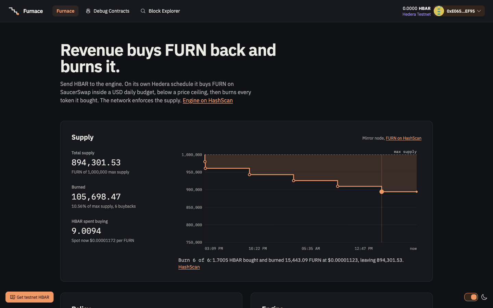
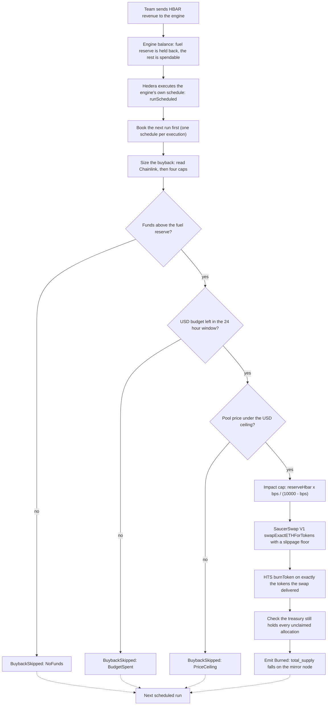

# Furnace

A buyback-and-burn engine for Hedera tokens, as a [Scaffold-HBAR](https://docs.hedera.com/solutions/tools/scaffold-hbar/index) template. A token team sends protocol revenue (HBAR) to `FurnaceEngine`. On a Hedera Schedule Service schedule the engine books for itself, it buys the team's HTS token back on SaucerSwap V1 inside a Chainlink-priced USD daily budget, in lots of bounded size with a minimum gap between buys, never above a USD price ceiling, never moving the pool by more than a set price impact and never while the pool's price sits above its own time-weighted average, then burns what it bought with the HTS supply key it holds. The token's `total_supply` falls on the mirror node, where anyone can read it.

**3 burns executed by the Hedera network on the engine's own schedule, 0 triggered by a person; supply 1,000,000 to 959,430.9642213 FURN (4.06% burned), plus two refusals on chain: a buy TooSoon inside the minimum gap and a buy refused as TwapDeviation right after a swap moved the pool.** Counted from the mirror node on engine v2 at 2026-10-04 20:28 UTC. The owner's first `buyback()` is the only burn with `scheduled: false`. Engine v1, the earlier deployment, keeps burning on its own schedule: 5 scheduled burns, 10.57% of its supply.

```bash
M=https://testnet.mirrornode.hedera.com/api/v1; E=0x3249617e95785640140A05f55Fd9c798F0E116Df
curl -s "$M/contracts/$E/results/logs?order=asc&limit=100" | jq -r '.logs[]|select(.topics[0]|startswith("0xe6d083b0"))|.timestamp' |
  while read ts; do curl -s "$M/transactions?timestamp=$ts" | jq -r '.transactions[0].scheduled'; done | sort | uniq -c   # 3 true, 1 false
curl -s $M/tokens/0.0.10860654 | jq -r .total_supply                                                               # 95943096422130 (8 decimals)
```



Contents: [Make it your token's buyback engine](#make-it-your-tokens-buyback-engine) | [Verify the claims](#verify-the-claims-yourself) | [How the pieces connect](#how-the-pieces-connect) | [Quickstart](#quickstart) | [How it works](#how-it-works) | [Proven on testnet](#proven-on-hedera-testnet) | [Customize](#customize) | [Deploy to mainnet](#deploy-to-mainnet) | [Testing](#testing)

**Judge quick start**

- Problem: token teams have no trust-minimised way to spend protocol revenue on buybacks, and burns that park tokens in an account leave `total_supply` unchanged.
- Hedera services: HTS (token creation, `burnToken`, supply key held by the engine), Hedera Schedule Service HIP-1215 (the engine schedules its own runs). Ecosystem: SaucerSwap V1 (pool and swaps), Chainlink HBAR/USD (USD budget).
- Scaffold: `npm create scaffold-hbar@latest -- --template aarav1656/scaffold-hbar-furnace`
- Reproduce everything on testnet with a funded key in `packages/foundry/.env`: `yarn foundry:live` (token, pool, manual burn, network-triggered burn, mirror-node assertions).
- Proof 1, a burn nobody called: [network-executed scheduled run](https://hashscan.io/testnet/transaction/1791141365.032140514) on engine v2, `CONTRACTCALL`, `scheduled: true`, paid by the engine, emitting `Burned`.
- Proof 2, supply falls on the mirror node: [token 0.0.10860654](https://hashscan.io/testnet/token/0.0.10860654) `total_supply` stands at 95,943,096,422,130 after 3 scheduled burns and one manual one, exactly 100,000,000,000,000 minus the 4,056,903,577,870 burned.
- Proof 3, a pool moved right before a buy is refused: [swap](https://hashscan.io/testnet/transaction/0x254c92f73c72060b953995a311428b7d4db4afa380367bc4886bdd84b5cc5dd8) then [buyback](https://hashscan.io/testnet/transaction/0xaaeb7948bac3f9239d153fc77e40ab5a6a5f46a723844667c70bf1affd8beb82), `BuybackSkipped(TwapDeviation)`, 0 burned, engine balance unchanged.
- Offline check: `yarn foundry:test` runs 269 tests with no network.

The `--` matters with `npm create`: without it npm keeps `--template` for itself. `npx create-scaffold-hbar@latest --template aarav1656/scaffold-hbar-furnace` is equivalent.

**Live app:** [furnace-hbar.vercel.app](https://furnace-hbar.vercel.app) reads the live engine on Hedera testnet: supply falling burn by burn, policy and budget left, next scheduled burn, and the activity feed. Anyone can send revenue from the page.

## Make it your token's buyback engine

1. Scaffold with the command above: `npm create scaffold-hbar@latest -- --template aarav1656/scaffold-hbar-furnace`.
2. Set the policy in `packages/foundry/script/Deploy.s.sol` or the environment variables it reads: `DAILY_BUDGET_USD` for the daily USD budget, `MAX_IMPACT_BPS` for the max price impact, `PRICE_CEILING_USD` for the USD price ceiling, plus `SLIPPAGE_BPS`, `FUEL_RESERVE_HBAR` and `MIN_SPEND_HBAR_E8`. The token's supply, decimals and liquidity share (`TOKEN_SUPPLY`, `DECIMALS`, `LIQUIDITY_PCT`) and the run interval (`TEST_INTERVAL`, `FINAL_INTERVAL`) are environment variables of `script/live-testnet.sh`; the token name and symbol sit in its `initialize` call.
3. Put a funded ECDSA testnet key in `packages/foundry/.env` as `DEPLOYER_PRIVATE_KEY` and run `yarn foundry:live`. It deploys the engine, creates the token, creates and seeds the pool, sends revenue, burns once by hand and once on a network-triggered schedule, and regenerates `packages/nextjs/contracts/deployedContracts.ts` for the app.
4. Run `yarn next:dev` and open `localhost:3000`. Point protocol revenue at the engine with the Send revenue panel or a plain HBAR transfer to the engine's address.
5. The engine burns on its own schedule from there. Each burn steps the supply chart on the page down, and the same fall shows in the mirror node's `total_supply`.

## Verify the claims yourself

The commands below are copied from [docs/testnet-evidence.md](docs/testnet-evidence.md); run the setup block at the top of that file first, it sets the variables the commands read.

- The token's `total_supply` on the mirror node falls with every burn and only with burns:

  ```bash
  curl -s $M/tokens/$TID | jq -r .total_supply
  ```

- Hedera executes the engine's own schedule with no human transaction behind the run: the record reads `CONTRACTCALL`, `scheduled: true`, paid by the engine:

  ```bash
  curl -s "$M/transactions?timestamp=1791020653.144458104" |
    jq -c '.transactions[0]|{name,result,scheduled,charged_tx_fee,transaction_id,entity_id,transfers:[.transfers[]|{account,amount}]}'
  ```

- The engine is the token's treasury and the supply key is the only key the token has:

  ```bash
  curl -s $M/tokens/$TID | jq '{name,symbol,decimals,supply_type,max_supply,treasury_account_id,supply_key:(.supply_key!=null),admin_key,wipe_key,freeze_key,pause_key,kyc_key,fee_schedule_key}'
  ```

- The LP tokens are held by the engine: the balance list shows the engine holds every unit a depositor received and the factory keeps only the pair's first-mint minimum:

  ```bash
  curl -s $M/tokens/0.0.10840040/balances | jq -c '.balances[]|select(.balance>0)'
  ```

- The 149 contract tests pass with no network:

  ```bash
  yarn foundry:test
  ```

What the scaffold contains: one Solidity contract that is the whole protocol, 149 Foundry tests that need no network, a script that runs the full loop on testnet (token, pool, manual burn, network-triggered burn) and prints a HashScan link per transaction, a Next.js app, and [AGENTS.md](AGENTS.md) for coding agents. Deeper reading lives in [docs/](docs): [architecture](docs/architecture.md), [testnet evidence](docs/testnet-evidence.md) with a re-check command for every claim, and [Hedera behaviours](docs/hedera-gotchas.md).

## Why a burn that changes supply

Revenue-funded buybacks are an established practice on Hedera. SaucerSwap runs them for SAUCE ("Unified BrewSaucer: buybacks and burn", [tokenomics overview](https://docs.saucerswap.finance/tokenomics/overview)). Its burn account, 0.0.9209843, holds 1,180,632.7 SAUCE on mainnet: the tokens are parked in a keyless account, so they are out of circulation while the token's total supply is unchanged.

Furnace takes the other route. The engine is the token's treasury and holds its supply key, so the burn is an HTS `burnToken` and `total_supply` itself falls. There is no parking account to audit. The token has one key, the supply key, held by the engine; admin, wipe, freeze, pause, KYC and fee schedule keys are null on the mirror node, so no wipe or freeze can touch a holder. The engine exposes no function that transfers FURN out except `claimTeamAllocation` (the team allocation, once) and the one-time `seedLiquidity` deposit into the pair, and the burn is `burnToken` on the tokens the swap just delivered: the number on the mirror node is the number.

## Why it needs SaucerSwap V1, Chainlink, HTS and HSS

Each integration does a job nothing else in the stack can do. Remove one and a named function stops working.

| Piece | What it does here | Without it |
| --- | --- | --- |
| SaucerSwap V1 | `createPool` makes the token/WHBAR pair, `seedLiquidity` deposits the liquidity allocation with `addLiquidityETH`, every buyback is a `swapExactETHForTokens`. Pair reserves give exact constant-product price impact, so the impact cap is arithmetic, not an estimate. | The engine has no market to buy from and no on-chain reserves to size a trade against. |
| Chainlink HBAR/USD | Budget and ceiling are in USD, so a team sets "$500 a day", not a moving HBAR number. `hbarUsd()` reverts on a stale or non-positive answer, which stops the buyback. | The budget is a fixed HBAR amount whose dollar value drifts with the market, and the ceiling has no price to compare against. |
| HTS | `initialize` creates the token from the contract: finite max supply equal to total supply, the engine as treasury and sole supply-key holder, no admin, wipe, freeze, pause or KYC key. `burnToken` runs inside the buyback transaction. | There is no token only the engine can burn, and no network-enforced supply to read. |
| HSS (HIP-1215) | `startAutomation` has the engine call `scheduleCall` on itself. Hedera executes `runScheduled`, which books the next run. The engine pays for its own runs from native HBAR. | Buybacks need an off-chain keeper with a funded key, and the program stops when the keeper does. |
| Exchange rate precompile (0x168) | SaucerSwap prices the pair creation fee in tinycents. `poolCreationFee()` converts it to tinybar at call time. | The pair fee quote goes stale as the HBAR rate moves and `createPool` reverts or overpays. |

## How the pieces connect



## Quickstart

Prerequisites:

- Node.js 20.18.3 or later
- Yarn (`corepack enable`) or npm. In an npm project every `yarn x` below is `npm run x`
- [Foundry](https://book.getfoundry.sh/getting-started/installation) (`forge`, `cast`), plus `jq`, `curl` and `bc` for the live script
- Foundry 1.7.1 (`foundryup --install v1.7.1`): Foundry 1.8 sends EIP-1898 block objects that the Hashio relay rejects with `-32602` ([hiero-json-rpc-relay#5826](https://github.com/hiero-ledger/hiero-json-rpc-relay/issues/5826)), see [docs/hedera-gotchas.md](docs/hedera-gotchas.md)
- An ECDSA Hedera testnet account funded from the [portal faucet](https://portal.hedera.com/faucet)

```bash
# 1. Contract tests. No network, no key.
yarn foundry:test

# 2. Put the funded account's key in packages/foundry/.env (install copies .env.example to it)
#    add a line:  DEPLOYER_PRIVATE_KEY=0x...

# 3. Deploy an engine to testnet and run the whole loop, with a HashScan link per transaction
yarn foundry:live

# 4. Start the app at http://localhost:3000
yarn next:dev
```

Step 3 deploys `FurnaceEngine`, calls `initialize` with 20 HBAR (HTS keeps its creation fee, the rest stays in the engine) to create a 1,000,000 token supply at 8 decimals with 40% reserved for liquidity, creates the SaucerSwap V1 pair, seeds it with 25 HBAR, sends 35 HBAR of revenue, runs a manual `buyback()`, claims the team allocation, starts automation at 180 seconds, waits for the network to run the schedule and burn, and leaves a 6 hour schedule running. It reads the mirror node's `total_supply` before and after each burn, and exits non-zero if the network-triggered run did not burn. It regenerates `packages/nextjs/contracts/deployedContracts.ts`, so step 4 shows the engine you just deployed.

Reuse a deployed engine instead of deploying: `ENGINE=0x... yarn foundry:live` skips every step the engine has already finished.

## Environment variables

Nothing is required for `yarn foundry:test` or `yarn next:dev`. `DEPLOYER_PRIVATE_KEY` is required to deploy. The key goes in `packages/foundry/.env`, which is gitignored; never commit it and never paste it into a chat or a command line.

| Variable | Where | Read by | Purpose | Default |
| --- | --- | --- | --- | --- |
| `DEPLOYER_PRIVATE_KEY` | `packages/foundry/.env` | `live-testnet.sh` | ECDSA key of the funded testnet account that deploys and owns the engine | none |
| `HEDERA_RPC_URL` | `packages/foundry/.env` | `live-testnet.sh`, `foundry:test:testnet`, `make fork` | JSON-RPC endpoint | `https://testnet.hashio.io/api` |
| `FURNACE_RPC_URL` | shell | `live-testnet.sh` | Overrides `HEDERA_RPC_URL` for the live script only | `HEDERA_RPC_URL` |
| `MIRROR_URL` | shell | `live-testnet.sh` | Mirror node REST base | `https://testnet.mirrornode.hedera.com/api/v1` |
| `ENGINE` | shell | `live-testnet.sh` | Existing engine address to reuse | deploy a new one |
| `TOKEN_SUPPLY`, `DECIMALS`, `LIQUIDITY_PCT` | shell | `live-testnet.sh` | Token the engine creates: whole-token supply, decimals, percent reserved for the pool | `1000000`, `8`, `40` |
| `SEED_HBAR`, `FUND_HBAR` | shell | `live-testnet.sh` | HBAR paired with the liquidity allocation, and HBAR sent as revenue plus fuel | `25`, `35` |
| `TEST_INTERVAL`, `FINAL_INTERVAL` | shell | `live-testnet.sh` | Seconds for the run the script waits on, and for the schedule it leaves running | `180`, `21600` |
| `DAILY_BUDGET_USD` | shell, at deploy | `Deploy.s.sol` | USD per 24 hours, 8 decimals | `1e8` ($1.00) |
| `MAX_IMPACT_BPS` | shell, at deploy | `Deploy.s.sol` | Price impact one buyback may cause, at most 1000 | `500` |
| `PRICE_CEILING_USD` | shell, at deploy | `Deploy.s.sol` | USD per whole token, 8 decimals; 0 for none | `0` |
| `SLIPPAGE_BPS` | shell, at deploy | `Deploy.s.sol` | Tolerance under the router quote, at most 1000 | `300` |
| `FUEL_RESERVE_HBAR` | shell, at deploy | `Deploy.s.sol` | Whole HBAR that buybacks never touch | `25` |
| `MIN_SPEND_HBAR_E8` | shell, at deploy | `Deploy.s.sol` | Smallest buyback in tinybar | `1e8` (1 HBAR) |
| `LOCALHOST_KEYSTORE_ACCOUNT`, `ALCHEMY_API_KEY`, `FORK_URL` | `packages/foundry/.env`, shell | scaffold keystore scripts, `make fork` | Scaffold-HBAR tooling for keystore deploys and forks | scaffold defaults |
| `NEXT_PUBLIC_HEDERA_TESTNET_RPC_URL`, `NEXT_PUBLIC_HEDERA_MAINNET_RPC_URL` | `packages/nextjs/.env.local` | app | JSON-RPC endpoints | Hashio testnet and mainnet |
| `NEXT_PUBLIC_HEDERA_TESTNET_MIRROR_URL` | `packages/nextjs/.env.local` | app | Mirror node the app reads supply, logs and associations from | `https://testnet.mirrornode.hedera.com` |
| `NEXT_PUBLIC_WALLET_CONNECT_PROJECT_ID` | `packages/nextjs/.env.local` | app | Your WalletConnect project id | a shared scaffold id |
| `HEDERA_MIRROR_TESTNET_URL`, `HEDERA_MIRROR_MAINNET_URL` | `packages/nextjs/.env.local` | `/api/hedera/account` | Mirror nodes behind the debug tools | the public Hedera mirror nodes |
| `NEXT_PUBLIC_IGNORE_BUILD_ERROR` | build environment | `next.config.ts` | `true` lets `next build` pass with type or lint errors | off |
| `PORT`, `VERCEL_PROJECT_PRODUCTION_URL` | shell | page metadata | Base URL for metadata | `3000`, unset |

## How it works

Everything below is in `packages/foundry/contracts/FurnaceEngine.sol`. Money is tinybar (8 decimals) inside the EVM; USD figures have 8 decimals; token amounts are raw units of the token's own decimals.

### Setup: three owner calls

1. `initialize(name, symbol, totalSupply, decimals, liquidityAllocation)` creates the HTS token with the engine as treasury and sole supply-key holder, finite `maxSupply` equal to `totalSupply`, and no other key. `liquidityAllocation` is reserved for the pool; the rest is the team allocation (`teamUnclaimed`).
2. `createPool()` sends `poolCreationFee()` (SaucerSwap's tinycent fee converted through 0x168) to the factory, associates the engine with the pair's LP token and records which side of the pair the token sorts on.
3. `seedLiquidity(minToken, minHbar)` deposits the liquidity allocation and the HBAR sent with `addLiquidityETH`, minting the LP tokens to the engine. `claimTeamAllocation(to)` pays the team allocation to a wallet that has associated the token.

After that, HBAR sent to the engine is revenue. `buyback()` runs on demand for the owner and on schedule for the engine itself.

### The buyback: one function sizes it, four caps bind it

`_plan()` is read by both `buyback()` and the `previewBuyback()` view. It reads the pair reserves (`R` HBAR in tinybar, `T` tokens), then checks four caps in a fixed order. Each cap that falls under `minSpend` stops the run and names itself in `BuybackSkipped`. Otherwise `spend = min(available, byBudget, byCeiling, byImpact)`.

| Order | Cap | Formula | Skip reason |
| --- | --- | --- | --- |
| 0 | Pool exists and holds both sides | `R > 0 and T > 0` | `NotReady` |
| 1 | Funds | `available = balance - fuelReserve` (0 if the balance is under the reserve) | `NoFunds` |
| 2 | USD budget | `byBudget = (dailyBudgetUsd - spentToday) x 1e8 / hbarUsd` | `BudgetSpent` |
| 3 | USD price ceiling | `byCeiling = R x (sqrt(ceiling / price) - 1)`, none when `priceCeilingUsd` is 0 | `PriceCeiling` |
| 4 | Price impact | `byImpact = R x maxImpactBps / (10000 - maxImpactBps)` | `ImpactCap` |

**Fuel reserve.** Native HBAR is both budget and fuel. `fuelReserve` is an immutable amount that no buyback touches; it pays for the engine's own schedules.

**Budget window.** `dailyBudgetUsd` is spent inside a 24 hour window that opens at the first buyback after the previous window expired. `spentToday` reads as 0 once `block.timestamp >= windowStart + 1 day`. Each spend adds `ceil(spend x hbarUsd / 1e8)` to the window, rounded up, so rounding can never let a day pass its budget.

**Ceiling.** With spot price `p = R x 10^decimals x hbarUsd / (T x 1e8)` (USD per whole token, 8 decimals) and ceiling `c`, buying `x` HBAR into a constant-product pool multiplies the price by `(1 + x/R)^2` before fees. Solving `(1 + x/R)^2 <= c/p` gives the headroom `x = R x (sqrt(c/p) - 1)`. The pool's 0.3% fee only lowers the real post-trade price and every rounding floors, so the pool never ends above `c`. When `p >= c` the headroom is 0 and the run skips. When `c > 100p` the headroom exceeds what the impact cap allows, so the engine skips the square root.

**Impact.** Buying `x` into reserve `R` returns tokens `x / (R + x)` below what the pre-trade spot price would give. Setting that share to `maxImpactBps / 10000` and solving for `x` gives `R x bps / (10000 - bps)`. At 500 bps and `R` of 2,500,000,000 tinybar that is 131,578,947 tinybar (1.3158 HBAR), the size of the first live burn.

**Swap and slippage.** The engine asks the router for `getAmountsOut(spend)` and passes 97% of the quote (`slippageBps` 300) as the swap floor. A fill under the floor reverts the run before anything is burned.

**Burn.** `buyback()` reads its token balance before and after the swap and burns exactly the difference with `burnToken`. HTS reports `supplyAfter`, which goes in the `Burned` event. A last check requires the engine's token balance to still cover `teamUnclaimed + liquidityUnseeded`; otherwise `AllocationBreach` rolls the whole run back.

**Allocations are never burned.** The team and liquidity allocations sit in the engine's treasury balance next to the tokens a swap delivers. Burns only ever take the swap's delta, and the check above proves it on every run.

**The engine holds every LP token and exposes no function that transfers them.** The LP tokens are minted to the engine and the contract has no function that transfers or approves them. `test_lpTokens_neverLeaveTheEngine` and `invariant_liquidityIsLockedForGood` (the engine's LP balance equals the LP supply minted to it) prove it under random call sequences, and `test_stateChangingSurface_isExactlyTheReviewedList` reads the compiled ABI and fails when a state-changing function appears that is not on the reviewed list, so a withdraw or sweep cannot be added unnoticed.

### Automation

`startAutomation(interval)` (owner, 60 seconds to 60 days) books the first run through the Schedule Service at 0x16b. At the expiry Hedera calls `runScheduled` with the engine as `msg.sender`, which is its only access check. `runScheduled` books its successor first, then calls `buyback()` inside `try/catch`, emitting `ScheduledRun(tokensBurned)` or `ScheduledRunFailed(reason)`. A failed buyback costs one run and never the chain; a lost booking sets `runInterval` to 0 so the engine reads as off and can be restarted. Gas per run is 4,000,000, the contract refuses anything under 3,000,000, and the payer must hold the full gas reservation (4,000,000 x 88 tinybar = 3.52 HBAR), so keep `fuelReserve` well above it.

`status()` returns the whole dashboard in one call and never reverts on a stale oracle: USD figures read as zero instead.

## Proven on Hedera testnet

| What | Evidence |
| --- | --- |
| FurnaceEngine v2 (canonical) | [0.0.10860653](https://hashscan.io/testnet/contract/0x3249617e95785640140A05f55Fd9c798F0E116Df), `0x3249617e95785640140A05f55Fd9c798F0E116Df`, Sourcify exact match |
| FurnaceEngine v1 (earlier deployment) | [0.0.10839961](https://hashscan.io/testnet/contract/0.0.10839961), `0x706947eCC0411bAdeF790282bb89b80126357D9D` |
| Token FURN | [0.0.10840036](https://hashscan.io/testnet/token/0.0.10840036): 1,000,000 tokens, 8 decimals, finite `max_supply` 100000000000000, treasury 0.0.10839961 (the engine), supply key set, admin, wipe, freeze, pause and KYC keys all null (mirror node read) |
| Token creation | [initialize tx](https://hashscan.io/testnet/transaction/0x48a49967751c8b124a53aff0144db7f87b13c86bc5696438767e7ae02cb96218), 232,992 gas, 20 HBAR sent and HTS keeps its creation fee |
| Pair creation | [createPool tx](https://hashscan.io/testnet/transaction/0xc0d1579ca2a712d4e7aac065f76e62387f86434c210ee838e960f221994a486e), 6,622,028 gas, 1,995,165,050 tinybar (19.95 HBAR) pair fee through 0x168. Pair [0.0.10840039](https://hashscan.io/testnet/contract/0x2989b5a6C8856143Ea04898757F360239553Cf05), LP token [0.0.10840040](https://hashscan.io/testnet/token/0.0.10840040) |
| Liquidity | [seedLiquidity tx](https://hashscan.io/testnet/transaction/0x4b7dc30f8d6d20227bf7ce07e30ee97c289999153e2a27f78fcdc5845a339903): 25 HBAR and 400,000 FURN. The engine holds 316,227,765,016 LP, every unit a depositor received (sqrt(2.5e9 x 4e13) less the 1,000 the pair keeps at its first mint) |
| Manual burn | [buyback tx](https://hashscan.io/testnet/transaction/0x389b5f7eae1a05bb09d5d6bb7fafa178b53b645dd963e2d565a5bf692bf687fc): 131,578,947 tinybar (1.3158 HBAR, the impact cap) bought 1,994,299,139,566 raw FURN (19,942.99) and burned it. `total_supply` 100,000,000,000,000 to 98,005,700,860,434, a fall of exactly the amount burned |
| Scheduled burn 1 | [consensus 1791020653.144458104](https://hashscan.io/testnet/transaction/1791020653.144458104): the engine's own schedule (CONTRACTCALL, `scheduled: true`, paid by the engine) spent 138,504,155 tinybar (1.3850 HBAR) and burned 1,894,868,416,787 raw FURN (18,948.68). `total_supply` 98,005,700,860,434 to 96,110,832,443,647, a fall of exactly the amount burned. No transaction of ours was sent in that window |
| Scheduled burn 2 | [consensus 1791042280.004353208](https://hashscan.io/testnet/transaction/1791042280.004353208): CONTRACTCALL, `scheduled: true`, paid by the engine, spent 145,793,847 tinybar (1.4579 HBAR) and burned 1,800,395,051,016 raw FURN (18,003.95). `total_supply` after: 94,310,437,392,631 |
| Scheduled burn 3 | [consensus 1791063880.037958663](https://hashscan.io/testnet/transaction/1791063880.037958663): CONTRACTCALL, `scheduled: true`, paid by the engine, spent 153,467,207 tinybar (1.5347 HBAR) and burned 1,710,631,889,888 raw FURN (17,106.32). `total_supply` after: 92,599,805,502,743 |
| Scheduled burn 4 | [consensus 1791085478.123850208](https://hashscan.io/testnet/transaction/1791085478.123850208): CONTRACTCALL, `scheduled: true`, paid by the engine, spent 161,544,429 tinybar (1.6154 HBAR) and burned 1,625,344,103,411 raw FURN (16,253.44). `total_supply` after: 90,974,461,399,332 |
| Scheduled burn 5 | [consensus 1791107076.082884956](https://hashscan.io/testnet/transaction/1791107076.082884956): CONTRACTCALL, `scheduled: true`, paid by the engine, spent 170,046,767 tinybar (1.7005 HBAR) and burned 1,544,308,541,588 raw FURN (15,443.09). `total_supply` after: 89,430,152,857,744 |
| Totals | Read on 2026-10-04 at 14:29 UTC: `totalBurned()` 10,569,847,142,256 and mirror `total_supply` 89,430,152,857,744, which sum to the original 100,000,000,000,000 (10.570% burned). `totalSpentHbar()` 900,935,352 tinybar (9.0094 HBAR) over six burns. The next run is booked for consensus second 1791128675 |

Every row has a re-check command in [docs/testnet-evidence.md](docs/testnet-evidence.md). `yarn foundry:live` reproduces the loop from a fresh deploy.

### Measured costs

Fee is the network charge on the mirror node record; these transactions were charged 84 tinybar per gas.

| Step | Gas | HBAR |
| --- | --- | --- |
| Deploy `FurnaceEngine` | 3,400,605 | 2.8565 |
| `initialize` (gas only; HTS keeps about 11.8 HBAR of the 20 sent as its creation fee) | 232,992 | 0.1957 |
| `createPool` (gas only; plus the 19.95 HBAR pair fee) | 6,622,028 | 5.5625 |
| `seedLiquidity` | 993,009 | 0.8341 |
| Manual `buyback()` | 361,563 | 0.3037 |
| Associate a wallet with the token (HIP-719) | 726,488 | 0.6102 |
| `claimTeamAllocation` | 51,231 | 0.0430 |
| `startAutomation` | 1,509,024 | 1.2675 |
| `stopAutomation` | 99,514 | 0.0835 |
| Scheduled run, network fee charged to the engine | n/a | 1.4179 |

A scheduled run also moves its buy into the pool: the first one debited the engine 280,298,591 tinybar, 141,794,436 of fee and 138,504,155 of swap. The reservation a run needs is 3.52 HBAR, so the 25 HBAR fuel reserve alone pays for `(25 - 3.52) / 1.4179 + 1` = 16 runs, four days at 6 hours, and every HBAR of revenue sent to the engine extends that.

## Customize

| Change | How |
| --- | --- |
| Daily budget | `DAILY_BUDGET_USD` at deploy (8 decimals), or `setDailyBudgetUsd(value)` later. `500e8` is $500 a day |
| Price impact | `MAX_IMPACT_BPS` at deploy, or `setMaxImpactBps(value)`. At most 1000 (10%) |
| Price ceiling | `PRICE_CEILING_USD` at deploy, or `setPriceCeilingUsd(value)`. USD per whole token with 8 decimals; `680` is $0.0000068; 0 for none |
| Slippage | `SLIPPAGE_BPS` at deploy, or `setSlippageBps(value)`. At most 1000 |
| Fuel reserve and minimum spend | `FUEL_RESERVE_HBAR`, `MIN_SPEND_HBAR_E8` at deploy. Both are immutable |
| Interval | `startAutomation(seconds)`, 60 to 5,184,000 (60 days). Stop first with `stopAutomation()` to change it |
| Token | `TOKEN_SUPPLY`, `DECIMALS`, `LIQUIDITY_PCT` for `yarn foundry:live`, or the arguments of `initialize` |
| Mainnet | The addresses in [Deploy to mainnet](#deploy-to-mainnet), then remove the `block.chainid != 296` gate in `script/Deploy.s.sol`. Deploy through the scaffold keystore flow: `yarn foundry:account:generate`, then `yarn foundry:deploy --network hedera_mainnet` |

The testnet addresses this template uses: Chainlink HBAR/USD proxy `0x59bC155EB6c6C415fE43255aF66EcF0523c92B4a` (8 decimals, staleness limit 25 hours), SaucerSwap V1 RouterV3 `0x0000000000000000000000000000000000004b40` (0.0.19264), factory `0x00000000000000000000000000000000000026E7` (0.0.9959), WHBAR token `0x0000000000000000000000000000000000003aD2`.

## Deploy to mainnet

`script/Deploy.s.sol` takes two addresses: the SaucerSwap V1 router and the Chainlink HBAR/USD proxy. The factory and WHBAR are read from the router in the constructor, so they follow it.

| Address | Testnet | Mainnet |
| --- | --- | --- |
| SaucerSwap V1 RouterV3 | `0x0000000000000000000000000000000000004b40` (0.0.19264) | `0x00000000000000000000000000000000002e7a5d` (0.0.3045981) |
| SaucerSwap V1 factory | `0x00000000000000000000000000000000000026E7` (0.0.9959) | `0x0000000000000000000000000000000000103780` (0.0.1062784) |
| WHBAR token | `0x0000000000000000000000000000000000003aD2` | `0x0000000000000000000000000000000000163B5a` (0.0.1456986) |
| WHBAR contract | | `0x0000000000000000000000000000000000163B59` (0.0.1456985) |
| Chainlink HBAR/USD proxy, 8 decimals | `0x59bC155EB6c6C415fE43255aF66EcF0523c92B4a` | `0xAF685FB45C12b92b5054ccb9313e135525F9b5d5` |

Verified 2026-10-04 09:05 UTC against `https://mainnet.hashio.io/api`. Router, factory, WHBAR and feed addresses come from the [SaucerSwap contract deployments](https://docs.saucerswap.finance/developerx/contract-deployments) and the [Chainlink Hedera mainnet feed directory](https://reference-data-directory.vercel.app/feeds-hedera-mainnet.json).

```bash
R=https://mainnet.hashio.io/api
cast code 0x00000000000000000000000000000000002e7a5d --rpc-url $R | wc -c   # 40237, router has code
cast call 0x00000000000000000000000000000000002e7a5d "factory()(address)" --rpc-url $R   # 0x...103780
cast call 0x00000000000000000000000000000000002e7a5d "whbar()(address)" --rpc-url $R     # 0x...163B5a
cast code 0x0000000000000000000000000000000000103780 --rpc-url $R | wc -c   # 43765
cast code 0x0000000000000000000000000000000000163b59 --rpc-url $R | wc -c   # 12149
cast code 0xAF685FB45C12b92b5054ccb9313e135525F9b5d5 --rpc-url $R | wc -c   # 19145
cast call 0xAF685FB45C12b92b5054ccb9313e135525F9b5d5 "latestRoundData()(uint80,int256,uint256,uint256,uint80)" --rpc-url $R
```

At the read, `latestRoundData` returned answer `10201640` ($0.10201640, 8 decimals) with `updatedAt` 1791102708 (2026-10-04 08:31:48 UTC), inside the engine's 25 hour staleness limit.

A mainnet fork test deploys `FurnaceEngine` with these addresses and asserts the router resolves the mainnet factory and WHBAR and that the Chainlink feed answers fresh:

```bash
cd packages/foundry
forge test --match-path test/MainnetConfig.fork.t.sol --fork-url https://mainnet.hashio.io/api -vv
```

## Project layout

```
packages/foundry/
  contracts/FurnaceEngine.sol       the whole protocol
  contracts/interfaces/             HTS 0x167, HSS 0x16b, exchange rate 0x168, HIP-719, SaucerSwap V1, Chainlink
  script/Deploy.s.sol               testnet addresses; policy from the environment
  script/live-testnet.sh            yarn foundry:live
  test/Furnace*.t.sol               setup, buyback, automation, invariants; FurnaceBase.sol etches the mocks
  test/mocks/                       HTS, HSS, 0x168 and a constant-product SaucerSwap V1
packages/nextjs/                    the app, plus scaffold /debug and /blockexplorer
  contracts/deployedContracts.ts    generated by the deploy, never edited by hand
docs/                               architecture, testnet evidence, Hedera behaviours
scripts/gate.sh                     scaffolds this template fresh and runs the full gate
AGENTS.md                           briefing for coding agents (CLAUDE.md loads it)
```

## Testing

```bash
yarn foundry:test
yarn workspace @sh/nextjs test   # 99 frontend tests on mirror-node data captured from the live engine
```

269 tests in eleven suites, none needing a network: setup (41), buyback (41, and 42 again with WHBAR sorting above the token), the average-price bound (24 and 25), lot size and gap (17 and 17), public buys, rearm and tagged revenue (17 and 17), automation (19) and nine invariants (64 runs of 40 calls each). A handler fires revenue, buybacks, policy changes, claims and automation at random while the invariants assert that the treasury always covers the unclaimed allocations, every unit of supply lost is a bought burn, liquidity never moves, the fuel reserve is never spent, no HBAR reaches the owner and the budget window never overspends its setting. A fuzz test checks that spend never exceeds the tightest cap. `FurnaceBase.sol` etches HTS, exchange rate and Schedule Service mocks and a constant-product SaucerSwap V1 at the addresses the contract calls, so `FurnaceEngine` runs unmodified.

The suite was mutation-checked with 51 deliberate bugs, each breaking one guard (fuel reserve, impact formula, ceiling clamp, budget rounding, oracle staleness, access control, burn accounting, the 0x168 conversion, slippage floor, a withdraw function and more). Every one turned the suite red and the restored file turned it green. The list is in [docs/architecture.md](docs/architecture.md#mutation-checks).

`forge fmt --check` and `forge lint` are clean. The `FurnaceEngine` runtime is 14,877 bytes against the 24,576 limit.

## Verify the gate

```bash
bash scripts/gate.sh
```

Scaffolds this template with `create-scaffold-hbar` into a temporary directory (from the committed HEAD, or from GitHub with `GATE_TEMPLATE=aarav1656/scaffold-hbar-furnace`), checks for committed secrets, runs `foundry:test`, `lint` and `next:build`, boots the app and requires HTTP 200 from `/`, `/debug` and `/blockexplorer`. `PM=npm bash scripts/gate.sh` runs it with npm. The same gate runs in `.github/workflows/scaffold-gate.yaml` for yarn and npm.

## Extend it with Hedera Harness

`.harness/` is a [hedera-harness](https://github.com/hedera-dev/hedera-harness) recipe for the first extension a token team makes: an owner-set buyback pause, enforced in `_plan()` so the scheduled run, the manual buyback and the dry run agree, and shown in the Policy panel. The engine already carries its own gap, lot size and average-price bound, so the recipe asks for a different control.
Run `npx hedera-harness doctor`, then `npx hedera-harness validate` for the validators alone or `npx hedera-harness run` to drive a coding agent from `.harness/prd.md`.
The harness decides the outcome: the repo's Foundry suite, lint, types and build, a harness-owned 9-test acceptance suite, and source checks that `runScheduled` books first and never reverts and that only bought tokens burn.
On the template as committed `validate` reports `findings=15`; with a reference implementation applied it reports `findings=0`, and five deliberate engine bugs each turn the pause checks red. Details in [.harness/README.md](.harness/README.md).

## Operate it from an AI agent

[`agent/`](agent/) is a Hedera Agent Kit plugin that gives an AI agent eight typed tools over the engine: `get_furnace_state`, `preview_buyback`, `send_revenue`, `buyback_now`, `set_policy`, `start_automation`, `stop_automation` and `rearm_automation`. The state tool splits every burn between the network's own scheduled runs and direct calls from the mirror node and reconciles the total to the contract's `totalBurned`. Every write checks its inputs against the contract's bounds before sending and proves its result from the engine's events and a read-back of the contract. The engine address is read from `packages/nextjs/contracts/deployedContracts.ts`, so a redeploy needs no code change.

```bash
cd agent && npm install && npm test
npx tsx examples/direct.ts                        # read-only, no LLM
npx tsx examples/direct.ts --revenue 1 swap-fees  # send 1 HBAR of tagged revenue (DEPLOYER_PRIVATE_KEY)
npx tsx examples/ask.ts "What would a buyback spend right now?"   # via the Agent Kit AI SDK adapter
```

One `send_revenue` call tagged `agent-plugin` is on testnet as [a succeeded transaction](https://hashscan.io/testnet/transaction/0.0.10855086-1791141309-672068643), and the plugin's burn ledger already counts one network burn and one direct burn. [agent/README.md](agent/README.md) covers loading the plugin into an Agent Kit app and an [Agent Lab](https://portal.hedera.com/agent-lab) agent.

## License

MIT. See [LICENCE](LICENCE).
