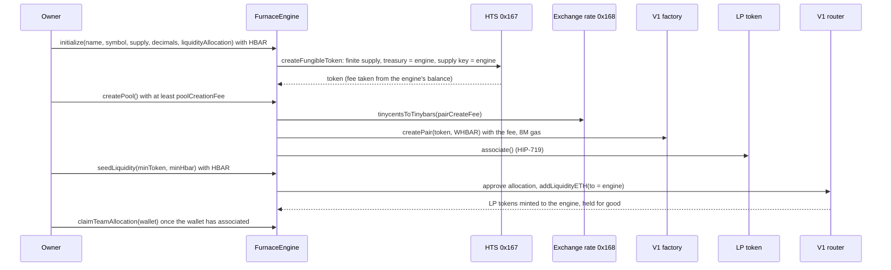
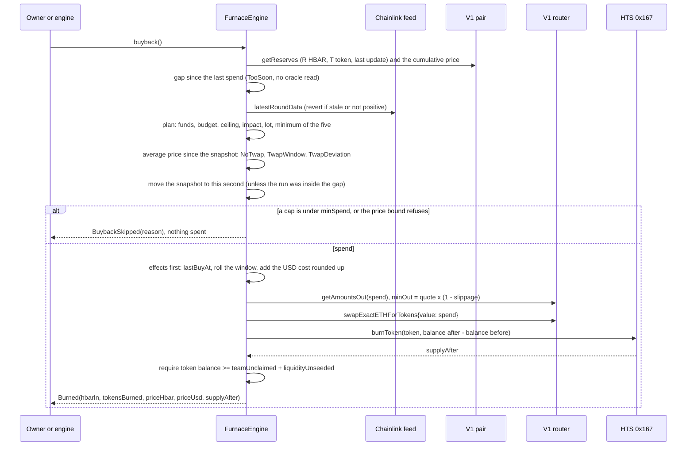
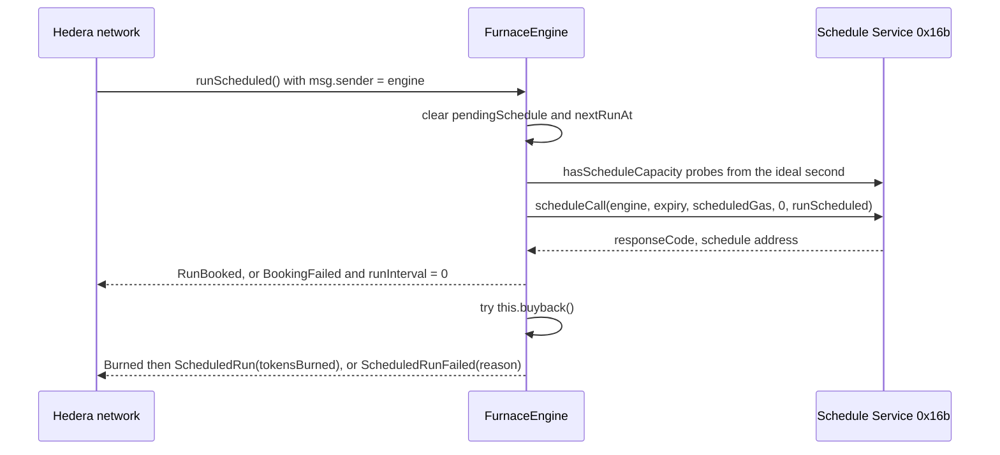

# Architecture

`FurnaceEngine` is one contract. It creates a team's HTS token with itself as treasury and sole supply-key holder, pairs the token with WHBAR on SaucerSwap V1 and keeps the LP tokens for good. HBAR sent to it is revenue. On a Hedera Schedule Service schedule it books for itself, the engine buys the token back inside a Chainlink-priced USD daily budget, in lots of bounded size with a minimum gap between buys, under a USD price ceiling and a price-impact cap, and only while the pool's spot price is within a set distance of the pair's own time-weighted average. It burns what it bought. Everything below is read from `packages/foundry/contracts/FurnaceEngine.sol`.

## Who can call what

| Caller | Functions |
| --- | --- |
| Anyone | send HBAR (`receive`, emits `RevenueReceived`; or `depositRevenue(source)`, emits `RevenueTagged`), `rearm` (only when automation is on and the booked run is overdue), `buyback` (only when `minGapSeconds` is set, and only a call that spends), `status`, `previewBuyback`, `twap`, `hbarUsd`, `poolCreationFee`, and every public getter |
| Owner | `initialize`, `createPool`, `seedLiquidity`, `claimTeamAllocation`, `setDailyBudgetUsd`, `setMaxImpactBps`, `setPriceCeilingUsd`, `setSlippageBps`, `setMaxLotUsd`, `setMinGapSeconds`, `setMaxTwapDeviationBps`, `startAutomation`, `stopAutomation`, `buyback` |
| The engine itself (a network-run schedule) | `runScheduled`, which calls `buyback` |

`buyback` reverts `NotOwnerOrSelf` for everyone else while no gap is set; once the owner sets `minGapSeconds` anyone may call it, and a call that would not spend reverts `BuybackRefused` without changing state. The router quote that sets the swap's minimum output comes from the same pool in the same transaction, so on its own it cannot see a pool that was moved just before the buy. The engine's price snapshot can: a buy is refused when spot sits more than `maxTwapDeviationBps` above the average price since that snapshot, so a swap placed right ahead of a run turns the run into a recorded `TwapDeviation` skip. Hedera has no public mempool, which leaves the known time of a scheduled run as the exposure; the average-price bound, the lot size, the minimum gap, the impact cap, the ceiling and the slippage floor bound every run. The contract has no function that sends HBAR or LP tokens out, and the only token transfer is `claimTeamAllocation`, which pays the team allocation, once, to a recipient the owner names.

## Contract state

Fixed at deployment (immutables):

| Name | Meaning | Testnet deploy |
| --- | --- | --- |
| `router` | SaucerSwap V1 RouterV3 | `0x...4b40` (0.0.19264) |
| `factory` | Read from `router.factory()` | `0x...26E7` (0.0.9959) |
| `whbar` | Read from `router.whbar()`, the WHBAR HTS token swap paths use | `0x...3aD2` |
| `hbarUsdFeed` | Chainlink HBAR/USD, 8 decimals | `0x59bC155EB6c6C415fE43255aF66EcF0523c92B4a` |
| `maxOracleAge` | Oldest accepted Chainlink answer | 90,000 s (25 h) |
| `fuelReserve` | Native HBAR (tinybar) that buybacks never touch | `FUEL_RESERVE_HBAR` x 1e8, 2,500,000,000 |
| `minSpend` | Smallest buyback, tinybar | `MIN_SPEND_HBAR_E8`, 100,000,000 |
| `scheduledGas` | Gas each scheduled run is booked with | 4,000,000 |

Owner-tunable policy (bounded, with events):

| Name | Meaning | Bounds | Testnet deploy |
| --- | --- | --- | --- |
| `dailyBudgetUsd` | USD per 24 hour window, 8 decimals | none | 100,000,000 ($1.00) |
| `maxImpactBps` | Most one buyback may move the pool, basis points | 1 to 1000 | 500 |
| `priceCeilingUsd` | USD per whole token, 8 decimals; 0 means no ceiling | up to `uint64` max | 0 |
| `slippageBps` | Most a swap may return below the router quote | 0 to 1000 | 300 |
| `maxLotUsd` | Most one buy may spend, USD with 8 decimals; 0 means no cap | 0, or `MIN_LOT_USD` (0.10 USD) up to `uint64` max | 30,000,000 ($0.30) |
| `minGapSeconds` | Seconds between two buys that spend; 0 means none | 0 to `MAX_MIN_GAP` (1 day) | 900 |
| `maxTwapDeviationBps` | Most spot may sit above the pair's average price, basis points | `MIN_TWAP_DEVIATION_BPS` (50) to `MAX_TWAP_DEVIATION_BPS` (2000) | 500 |

Storage the protocol keeps: `token`, `tokenDecimals`, `pair`, `lpToken`, `teamUnclaimed`, `liquidityUnseeded`, `totalBurned`, `totalSpentHbar`, `windowStart`, `spentTodayUsd`, `lastBuyAt`, `twapCumulative`, `twapAt`, `runInterval`, `pendingSchedule`, `nextRunAt`.

Constants: `MAX_IMPACT_BPS = 1000`, `MAX_SLIPPAGE_BPS = 1000`, `MIN_TWAP_WINDOW = 15 minutes`, `POOL_FEE_ALLOWANCE_BPS = 100`, `REARM_GRACE = 10 minutes`, `MIN_INTERVAL = 60`, `MAX_INTERVAL = 60 days`, `MIN_SCHEDULED_GAS = 3_000_000`, a 1 day budget window, a capacity probe of up to 16 seconds, and the three Hedera system contracts at `0x167` (Token Service), `0x168` (exchange rate) and `0x16b` (Schedule Service).

The constructor reverts `BadConfig` for a zero router or feed, a zero `minSpend`, `scheduledGas` under 3,000,000, an impact of 0 or over 1000, a slippage over 1000, a ceiling that does not fit in `uint64`, a lot between 0 and `MIN_LOT_USD` or past `uint64`, a gap over `MAX_MIN_GAP`, or a price bound outside 50 to 2000 basis points.

## Setup and the buyback, as sequences

### initialize, createPool, seedLiquidity (owner)



### buyback (owner on demand, the engine on schedule)



### scheduled run (the network)



The network pays from the engine's native HBAR. The run books its successor before it buys and wraps the buyback in `try/catch`, so a failed buyback costs one run and never the chain. A run books exactly once.

## The plan: formulas

`_plan()` is the single place a buyback is sized. `buyback()` acts on it and `previewBuyback()` returns it. Notation: `R` pair HBAR reserve in tinybar, `T` pair token reserve in raw units, `d` token decimals, `u` Chainlink HBAR/USD with 8 decimals.

```
0. NotReady      R == 0 or T == 0
0. TooSoon       block.timestamp < lastBuyAt + minGapSeconds                (no oracle read)
1. available     balance > fuelReserve ? balance - fuelReserve : 0          NoFunds      if < minSpend
2. byBudget      (dailyBudgetUsd - spentToday) x 1e8 / u                    BudgetSpent  if < minSpend
3. byCeiling     max uint if priceCeilingUsd == 0, else the headroom below  PriceCeiling  if < minSpend
4. byImpact      R x maxImpactBps / (10000 - maxImpactBps)                  ImpactCap    if < minSpend
5. byLot         max uint if maxLotUsd == 0, else maxLotUsd x 1e8 / u       LotCap       if < minSpend
6. average price NoTwap, TwapWindow, TwapDeviation                          allows or refuses, never sizes
spend = min(available, byBudget, byCeiling, byImpact, byLot)
```

Checks run in that order, so a skip names the first cap that fell under `minSpend`.

**Lot size and gap.** `maxLotUsd` is a USD cap per buy, converted at the Chainlink price like the budget, so a day's budget is spread over several buys. `minGapSeconds` is measured from the last buy that spent (`lastBuyAt`); a skip never starts or extends it, and the check runs before the oracle is read, so a run inside the gap needs no feed. Both apply to the scheduled run, the owner's `buyback()` and the dry run alike.

**Average-price bound.** The pair stores `priceCumulativeLast`, the sum of its price times the seconds each price stood (UQ112x112, HBAR per token), and updates it on its own swaps and liquidity changes. The engine reads it, adds the price the pair has held since its last update (`spotQ x (now - pairTimestamp)`), and keeps a snapshot `(twapCumulative, twapAt)`. With `W = now - twapAt`, the average since the snapshot is `twapQ = (cumulativeNow - twapCumulative) / W` and spot is `spotQ = R x 2^112 / T`. Spot above the average by `ceil((spotQ - twapQ) x 10000 / twapQ)` basis points more than `maxTwapDeviationBps` is refused as `TwapDeviation`. The rounding is up, so a bound is never crossed by rounding. A spot below the average is never refused: the engine buys cheaper. No snapshot, or a pair whose cumulative did not move, reads as `NoTwap`; a snapshot younger than `MIN_TWAP_WINDOW` (15 minutes) reads as `TwapWindow`, so spot is never trusted in place of an average. `seedLiquidity` takes the first snapshot. `buyback()` moves it to the current second on every run that gets as far as judging the price, a skip included, and a run younger than the minimum window leaves it alone; a run inside the gap is refused earlier and leaves it alone too. `_plan()` only reads the snapshot, so the preview and the run agree.

The bound holds against any move shorter than the window: a swap placed in the same block as a run moves spot by its full size and the average by nothing, so the engine records the skip and the next run measures from there. A price that stays moved for a whole window becomes the average, which is how a legitimate repricing is absorbed after one skipped run.

**Budget window.** `spentToday` reads 0 once `block.timestamp >= windowStart + 1 day`. The first buyback after expiry sets `windowStart` to its own timestamp and zeroes the spend. Each buyback adds `ceil(spend x u / 1e8)`, rounded up so a day's spend can never pass the budget by rounding.

**Ceiling headroom.** With spot price `p = R x 10^d x u / (T x 1e8)` (USD per whole token) and ceiling `c`, a constant-product buy of `x` multiplies the price by `(1 + x/R)^2` before fees. Requiring `(1 + x/R)^2 <= c/p` gives `x = R x (sqrt(c/p) - 1)`. The pool fee only lowers the real post-trade price, and every rounding floors, so the pool never ends above `c`. If `p >= c` the headroom is 0. If `c > 100 p` the bound lies past 9R, beyond the largest impact cap, and the engine returns the maximum without a square root. In integers the engine computes `priceNum = R x 10^d x u`, `ceilingNum = c x T x 1e8`, `root = sqrt(ceilingNum x 1e36 / priceNum)` and `x = R x (root - 1e18) / 1e18`.

**Impact.** Buying `x` into reserve `R` returns tokens `x / (R + x)` below the pre-trade spot quote. Setting `x / (R + x) = bps / 10000` and solving for `x` gives `R x bps / (10000 - bps)`.

**Slippage floor.** `minOut = getAmountsOut(spend)[1] x (10000 - slippageBps) / 10000`.

**Swap floor.** `minOut = max(getAmountsOut(spend)[1] x (10000 - slippageBps) / 10000, floor)`, where `floor = spend x 2^112 / twapQ x 10000 / (10000 + maxTwapDeviationBps) x (10000 - maxImpactBps) / 10000 x (10000 - 100) / 10000`. The router quote comes from the pool being traded in, so it cannot catch a router that gives a bad price and quotes it; the floor uses the engine's own average and the caps, and an honest fill at the extreme of every cap still clears it.

**Rearm.** `rearm()` is open to anyone. With automation on and the pending schedule missing, or overdue by more than `REARM_GRACE`, it deletes the dead schedule and books one replacement; a live schedule reverts `ScheduleLive`, so it cannot start a second chain. The engine pays for the replaced run as usual.

**Burn.** `tokensBurned = balance after the swap - balance before it`. The `Burned` event carries `priceHbar = spend x 10^d / tokensBurned` and `priceUsd = priceHbar x u / 1e8`.

### Worked example: the manual burn

Transaction [0x389b5f...](https://hashscan.io/testnet/transaction/0x389b5f7eae1a05bb09d5d6bb7fafa178b53b645dd963e2d565a5bf692bf687fc), the first `buyback()` after the pool was seeded. The engine balance before it was 4,411,059,225 tinybar: 811,300,973 left from `initialize` (20 HBAR less the 1,188,699,027 HTS fee), 99,758,252 left from `createPool` (20.95 HBAR less the 1,995,165,050 pair fee), and 3,500,000,000 of revenue. The seed's 25 HBAR went entirely into the pool.

| Step | Value |
| --- | --- |
| Reserves `R`, `T` | 2,500,000,000 tinybar, 40,000,000,000,000 raw FURN (8 decimals) |
| Chainlink `u` | 10,062,165 ($0.10062165) |
| Spot price | 2.5e9 x 1e8 x 10,062,165 / (4e13 x 1e8) = 628 USD-e8 per whole token ($0.00000628) |
| 1. `available` | 4,411,059,225 - 2,500,000,000 = 1,911,059,225 |
| 2. `byBudget` | 100,000,000 x 1e8 / 10,062,165 = 993,821,906 (9.94 HBAR) |
| 3. `byCeiling` | none, `priceCeilingUsd` is 0 |
| 4. `byImpact` | 2,500,000,000 x 500 / 9,500 = 131,578,947 |
| `spend` | min of the four = 131,578,947 (1.3158 HBAR), the impact cap |
| Router quote | 4e13 x 997 x 131,578,947 / (2.5e9 x 1000 + 997 x 131,578,947) = 1,994,299,139,566 |
| `minOut` at 3% | 1,994,299,139,566 x 9,700 / 10,000 = 1,934,470,165,379 |
| Delivered and burned | 1,994,299,139,566, equal to the quote |
| Tokens given up against the spot quote | 1,994,299,139,566 / (131,578,947 x 4e13 / 2.5e9) = 0.9473, a shortfall of 5.27% from the 0.3% fee and the 5% impact |
| `priceHbar` | 131,578,947 x 1e8 / 1,994,299,139,566 = 6,597 tinybar per whole token |
| `priceUsd` | 6,597 x 10,062,165 / 1e8 = 663 USD-e8 |
| USD cost, rounded up | ceil(131,578,947 x 10,062,165 / 1e8) = 13,239,691 ($0.1324) |
| `supplyAfter` | 100,000,000,000,000 - 1,994,299,139,566 = 98,005,700,860,434 |
| Reserves after | 2,631,578,947 and 38,005,700,860,434 |

The second burn, the network-triggered one, starts from those reserves: `byImpact` = 2,631,578,947 x 500 / 9,500 = 138,504,155, which is the 138,504,155 tinybar that run spent, and the router quote on `(2,631,578,947, 38,005,700,860,434)` is the 1,894,868,416,787 it burned. Both USD costs together are 13,239,691 + 13,936,517 = 27,176,208, which is the `spentTodayUsd` the engine reported afterwards ($0.2718 of the $1.00 window).

### Worked example: the ceiling

The live engine runs with no ceiling. Had it been deployed with `PRICE_CEILING_USD=680` ($0.0000068, 8 decimals) against the same pool, step 3 would bind:

| Step | Value |
| --- | --- |
| `priceNum` | 2.5e9 x 1e8 x 10,062,165 |
| `ceilingNum` | 680 x 4e13 x 1e8 |
| `c / p` | 1.081278 |
| `sqrt(c / p)` | 1.039845 |
| `byCeiling` | 2,500,000,000 x 0.039845 = 99,613,233 tinybar |
| `spend` | min(1,911,059,225, 993,821,906, 99,613,233, 131,578,947) = 99,613,233 |
| Post-trade spot price | 679.92 USD-e8 per whole token with the 0.3% fee, under the 680 ceiling |

The ceiling takes 32 million tinybar off the impact-bound buy, and the pool still ends under the ceiling. The same computation gives 0 for a ceiling of 628 or below (the pool is already at it) and 41,621,999 for 650.

## Invariants and the tests that enforce them

Each row lists tests in `packages/foundry/test/`. `yarn foundry:test` runs all of them without a network.

| # | Invariant | Tests |
| --- | --- | --- |
| 1 | The owner cannot take HBAR, LP tokens or bought tokens out | `test_stateChangingSurface_isExactlyTheReviewedList`, `test_noEntryPointSendsHbarToTheCaller`, `invariant_hbarNeverReachesTheOwner` |
| 2 | LP tokens never leave the engine | `test_lpTokens_neverLeaveTheEngine`, `invariant_liquidityIsLockedForGood` |
| 3 | Only tokens the swap delivered are burned, and the allocations are never touched | `test_burn_removesExactlyWhatWasBoughtFromTotalSupply`, `test_burn_neverTouchesTheTeamOrLiquidityAllocations`, `test_burn_withAnUnseededAllocationStillBurnsOnlyBoughtTokens`, `test_burn_aBurnThatTakesMoreThanWasBoughtIsCaughtAndRolledBack`, `invariant_treasuryAlwaysCoversTheUnclaimedAllocations`, `invariant_everyUnitOfSupplyLostIsABoughtBurn` |
| 4 | The fuel reserve is never spent on a buyback | `test_funds_spendIsAllRevenueAboveTheFuelReserve`, `test_funds_nothingAboveTheReserveSkipsTheRun`, `test_funds_minSpendBoundary`, `invariant_theFuelReserveIsNeverSpent` |
| 5 | The buyback never exceeds the tightest cap | `testFuzz_spendNeverExceedsTheTightestCap`, `test_preview_namesWhatBuybackThenDoes` |
| 6 | The impact cap equals constant-product price impact | `test_impactCap_bindsWhenRevenueIsLarge`, `test_impactCap_matchesConstantProductPriceImpact`, `test_impactCap_followsThePoolDepthAndTheSetting`, `test_impactCap_belowMinSpendSkipsTheRun` |
| 7 | The USD budget holds across runs, and rounding favours the budget | `test_budget_capsTheSpendInUsd`, `test_budget_exhaustedSkipsUntilTheWindowRolls`, `test_budget_isSharedAcrossRunsInTheWindow`, `test_budget_usdCostRoundsUpSoTheBudgetCannotBeOvershot`, `test_budget_followsTheHbarPrice`, `invariant_theBudgetWindowNeverOverspendsItsCurrentSetting` |
| 8 | The pool never ends above the USD ceiling | `test_ceiling_spotAtOrAboveItSkipsTheRun`, `test_ceiling_justAboveSpotClampsTheSpendSoThePriceNeverPassesIt`, `test_ceiling_farAboveSpotLeavesTheImpactCapInCharge`, `test_ceiling_zeroMeansNone`, `test_ceiling_isInUsdSoTheHbarPriceMovesIt` |
| 9 | A stale or non-positive oracle stops the buyback and never the dashboard | `test_oracle_staleAnswerRevertsTheBuyback`, `test_oracle_ageExactlyAtTheLimitIsStillFresh`, `test_oracle_nonPositiveAnswerReverts`, `test_status_staysReadableWhenTheOracleGoesStale` |
| 10 | A swap below the slippage floor reverts instead of settling | `test_slippage_aMarketThatMovedPastTheToleranceRevertsTheRun`, `test_slippage_aFillAtTheToleranceStandsAndOneBpWorseReverts`, `test_slippage_zeroToleranceRejectsAnyShortfall` |
| 11 | Only the owner or the engine may buy | `test_buyback_isOwnerOrSelfOnly`, `test_runScheduled_onlyTheEngineItselfMayCallIt` |
| 12 | `runScheduled` books its successor before it buys, never reverts, and keeps the chain through a stale oracle or a failed burn | `test_runScheduled_booksItsSuccessorBeforeItBuysAndBurns`, `test_runScheduled_neverRevertsOnAStaleOracleAndKeepsTheChain`, `test_runScheduled_neverRevertsWhenTheBurnFailsAndSpendsNothing`, `test_runScheduled_aSkippedRunStillKeepsTheChainAlive` |
| 13 | A lost booking turns automation off and the owner can restart it | `test_runScheduled_aLostBookingTurnsAutomationOffButStillBuys`, `test_start_revertsWhenTheNetworkRefusesTheBooking` |
| 14 | Intervals stay inside the 62 day network limit and a busy second is probed | `test_start_enforcesTheIntervalBounds`, `test_start_probesLaterSecondsWhenTheIdealOneIsBusy`, `test_start_givesUpWhenEveryProbedSecondIsBusy` |
| 15 | Stopping deletes the pending schedule | `test_stop_deletesThePendingScheduleAndClearsState`, `test_stop_isOwnerOnlyAndHarmlessWhenIdle`, `test_runScheduled_afterAStopDoesNothing` |
| 16 | The pair fee is the tinycent fee at the current rate | `test_poolCreationFee_isThePairTinycentFeeAtTheCurrentRate`, `test_createPool_rejectsAFeeBelowTheConvertedAmount`, `test_createPool_keepsAnyExcessAsRevenue` |
| 17 | Either token order works in the pair | `FurnaceReversedOrderTest` (the 41 buyback tests again), `test_poolOrder_matchesTheAddressSort`, `test_poolOrder_tokenIsToken0WhenWhbarSortsAbove` |
| 18 | The supply splits exactly into the liquidity and team allocations, and the team allocation pays out whole | `test_initialize_splitsTheSupplyIntoLiquidityAndTeamAllocations`, `test_claim_paysTheAssociatedRecipientTheWholeTeamAllocation`, `test_claim_failsForAnUnassociatedRecipientAndKeepsTheAllocation` |

| 19 | A pool moved right before a buy is refused and nothing is spent | `test_aSwapRightBeforeTheBuyIsRefusedAndNothingIsSpent`, `test_theSameRunWithoutTheSwapBuys`, `test_deviationBoundary_justInsideBuysAndJustOutsideSkips`, `test_aShortPumpBarelyMovesTheAverage`, `invariant_noBuySpendsWhileSpotIsOutsideTheAveragePriceBound` |
| 20 | The average price handles a missing snapshot, a young one, a stalled pair and a repricing | `test_aPoolSeededOutsideTheEngineHasNoSnapshotAndTheFirstRunOnlyRecordsOne`, `test_windowOneSecondShortOfTheMinimumSkips`, `test_windowAtTheMinimumBuys`, `test_aPairWhoseCumulativeDidNotMoveReadsAsNoAverageNeverAsAZeroPrice`, `test_theAverageCatchesUpAfterTheMoveHoldsAndTheSnapshotRefreshHeals`, `test_theEnginesOwnPriceImpactDoesNotTripTheNextRun` |
| 21 | The snapshot moves on judged runs only: seed, skip and spend move it, a run inside the gap or the minimum window does not | `test_seedingTheEngineStartsTheSnapshot`, `test_aBuybackMovesTheSnapshotToItsOwnSecond`, `test_aRunThatSkipsForAnotherReasonStillMovesTheSnapshot`, `test_aRunInsideTheMinimumWindowLeavesTheSnapshotAlone`, `test_gap_aRunInsideItLeavesThePriceSnapshotAlone` |
| 22 | A buy never spends past the lot cap, which follows the HBAR price in USD | `test_lot_capsOneBuyInUsd`, `test_lot_followsTheHbarPrice`, `test_lot_smallerOfLotAndBudgetWins`, `test_lot_aLotBelowTheMinimumSpendSkipsAndSaysSo`, `test_lot_theEarlierCapsAreNamedFirst`, `invariant_noBuySpendsPastTheLotCap` |
| 23 | No buy spends inside the gap, the gap reopens on the exact second, and a run inside it neither reverts nor stops booking | `test_gap_skipsInsideItAndBuysOnTheExactSecond`, `test_gap_aRunSkippedForAnotherReasonNeverStartsIt`, `test_gap_isCheckedBeforeTheOracleIsRead`, `test_gap_theOwnerCannotBypassItWithAManualBuyback`, `test_gap_scheduledRunInsideItNeitherRevertsNorStopsBooking`, `invariant_noBuySpendsInsideTheGap` |
| 25 | Anyone may trigger a gap-limited buy that spends; a refused outsider changes nothing; the owner keeps the skip record | `test_withAGapAnyoneMayTriggerABuy`, `test_anOutsiderInsideTheGapIsRefusedAndChangesNothing`, `test_anOutsiderCannotMoveTheSnapshotWithARefusedCall`, `test_withoutAGapOnlyTheOwnerOrTheEngineMayBuy`, `test_theGapBindsEveryCallerTheSame` |
| 26 | `rearm()` revives a dead chain and never starts a second | `test_rearm_leavesALiveScheduleAlone`, `test_rearm_booksAReplacementOnceTheScheduleIsOverdue`, `test_rearm_needsAutomationOn`, `test_rearm_revertsWhenTheNetworkRefusesTheBooking` |
| 27 | Tagged revenue is revenue with its source on the record | `test_depositRevenue_tagsTheSourceAndKeepsTheHbar`, `test_depositRevenue_refusesZeroAndPlainTransfersStayUntagged` |
| 28 | A router that quotes and fills a bad price is stopped by the average-price floor | `test_aRouterThatQuotesAndFillsABadPriceIsStoppedByTheAveragePriceFloor`, `test_aRouterWithinTheAllowanceStillFills`, `test_theFloorIsLooserThanAnHonestFillAtEveryCap` |
| 24 | The lot, gap and price-bound settings are owner-only and bounded, in the constructor and the setters | `test_setMaxLot_isOwnerOnlyBoundedAndEmits`, `test_setMinGap_isOwnerOnlyBoundedAndEmits`, `test_setMaxTwapDeviation_isBoundedAndEmits`, `test_setMaxTwapDeviation_isOwnerOnly`, `test_constructor_refusesPacingOutsideTheBounds`, `test_constructor_refusesADeviationOutsideTheBounds` |

269 tests in eleven suites: `FurnaceSetupTest` (41), `FurnaceBuybackTest` (41), `FurnaceReversedOrderTest` (42), `FurnaceTwapTest` (24), `FurnaceTwapReversedOrderTest` (25), `FurnacePacingTest` (17), `FurnacePacingReversedOrderTest` (17), `FurnaceAccessTest` (17), `FurnaceAccessReversedOrderTest` (17), `FurnaceAutomationTest` (19) and `FurnacePropertiesTest` (9 invariants, 64 runs of 40 calls, with an outside trader who pumps the pool and a handler that counts any buy outside the lot, gap or price bound). The mainnet fork test is skipped off a mainnet fork. `FurnaceBase.sol` etches HTS (0x167), the exchange rate (0x168) and the Schedule Service (0x16b) mocks, a constant-product SaucerSwap V1 factory, router and pair at the 0.3% fee, and a Chainlink feed, at the addresses the contract calls, so `FurnaceEngine` runs unmodified.

## Mutation checks

A test that passes with the guarded code deleted proves nothing, so each guard was broken on purpose, the suite was run, and the file was restored. Fifty-one mutants, every one turned the suite red, and the restored file turned it green each time:

| # | Mutant | Caught by |
| --- | --- | --- |
| 1 | Fuel reserve removed (`available = balance`) | `test_funds_minSpendBoundary` |
| 2 | Impact formula `R*m/(BPS-m)` changed to `R*m/BPS` | `test_impactCap_bindsWhenRevenueIsLarge` |
| 3 | Ceiling skip returns the maximum | `test_ceiling_isInUsdSoTheHbarPriceMovesIt` |
| 4 | USD cost rounding Ceil changed to Floor | `test_status_readsTheLivePoolAndTheBuybackLedger` |
| 5 | Budget window boundary `>=` changed to `>` | `test_status_budgetWindowReadsZeroSpendOnceItHasExpired` |
| 6 | Stale oracle check deleted | `test_oracle_staleAnswerRevertsTheBuyback` |
| 7 | `onlyOwnerOrSelf` check deleted | `test_buyback_isOwnerOrSelfOnly` |
| 8 | Burn the whole treasury balance instead of the bought amount | `test_runScheduled_aLostBookingTurnsAutomationOffButStillBuys` and others |
| 9 | LP token association deleted | `setUp` of every test that creates a pool |
| 10 | A lost booking no longer turns automation off | `test_runScheduled_aLostBookingTurnsAutomationOffButStillBuys` |
| 11 | `try this.buyback()` replaced by a plain call | `test_runScheduled_neverRevertsOnAStaleOracleAndKeepsTheChain` |
| 12 | Leftover liquidity allocation forgotten | `test_seedLiquidity_canFinishALeftoverAllocation` |
| 13 | `AllocationBreach` assertion deleted | `test_burn_aBurnThatTakesMoreThanWasBoughtIsCaughtAndRolledBack` |
| 14 | Pair fee used without the 0x168 conversion | `test_poolCreationFee_isThePairTinycentFeeAtTheCurrentRate` |
| 15 | An owner `withdraw` function added | `test_stateChangingSurface_isExactlyTheReviewedList` |
| 16 | Swap min-out slippage dropped | `test_slippage_aFillAtTheToleranceStandsAndOneBpWorseReverts` |
| 17 | Ceiling headroom clamp removed | `test_ceiling_justAboveSpotClampsTheSpendSoThePriceNeverPassesIt` |
| 18 | Deviation check replaced by `false` | `test_aSwapRightBeforeTheBuyIsRefusedAndNothingIsSpent`, `test_deviationBoundary_justInsideBuysAndJustOutsideSkips` and the invariant |
| 19 | Minimum average window check deleted | `test_aRunInsideTheMinimumWindowLeavesTheSnapshotAlone` and others |
| 20 | Wrong cumulative read (token0's for token1's) | `test_aSwapRightBeforeTheBuyIsRefusedAndNothingIsSpent` and 8 others, both pair orders |
| 21 | No-snapshot guard deleted | `test_aPoolSeededOutsideTheEngineHasNoSnapshotAndTheFirstRunOnlyRecordsOne` |
| 22 | Snapshot moves only on a spend | `test_aRunThatSkipsForAnotherReasonStillMovesTheSnapshot`, `test_theAverageCatchesUpAfterTheMoveHoldsAndTheSnapshotRefreshHeals` |
| 23 | Snapshot also moves on a run inside the gap | `test_gap_aRunInsideItLeavesThePriceSnapshotAlone` |
| 24 | Snapshot restarts inside the minimum window | `test_aRunInsideTheMinimumWindowLeavesTheSnapshotAlone` |
| 25 | Gap check replaced by `false` | `test_gap_skipsInsideItAndBuysOnTheExactSecond`, `test_gap_isCheckedBeforeTheOracleIsRead` and the invariant |
| 26 | `lastBuyAt` stamped before the skip return | `test_gap_aRunSkippedForAnotherReasonNeverStartsIt` |
| 27 | Lot dropped from the minimum of the caps | `test_lot_capsOneBuyInUsd` and the invariant |
| 28 | Lot below the minimum spend no longer skips | `test_lot_aLotBelowTheMinimumSpendSkipsAndSaysSo` |
| 29 | Price-bound bounds removed | `test_setMaxTwapDeviation_isBoundedAndEmits`, `test_constructor_refusesADeviationOutsideTheBounds` |
| 30 | Lot bounds removed | `test_setMaxLot_isOwnerOnlyBoundedAndEmits` |
| 31 | Gap bound removed | `test_setMinGap_isOwnerOnlyBoundedAndEmits` |
| 32 | Zero-average guard deleted (division by zero) | `test_aPairWhoseCumulativeDidNotMoveReadsAsNoAverageNeverAsAZeroPrice` |
| 33 | Price held since the pair's last update not added to the cumulative | 49 tests |
| 34 | `seedLiquidity` takes no first snapshot | 50 tests |
| 35 | Deviation rounded down instead of up | `test_deviationBoundary_justInsideBuysAndJustOutsideSkips` |
| 36 | Gap comparison `<` changed to `<=` | `test_gap_skipsInsideItAndBuysOnTheExactSecond` and 3 more |
| 37 | Minimum window comparison `<` changed to `<=` | 10 tests |
| 38 | Lot in USD used as if it were HBAR (no price division) | `test_lot_capsOneBuyInUsd` and 3 more |
| 39 | Outsiders always allowed to buy | `test_buyback_isOwnerOrSelfOnly`, `test_withoutAGapOnlyTheOwnerOrTheEngineMayBuy` |
| 40 | Outsider refusal removed | `test_anOutsiderInsideTheGapIsRefusedAndChangesNothing` and 3 more |
| 41 | Owner treated as an outsider | 58 tests |
| 42 | `rearm` live-schedule check removed | `test_rearm_leavesALiveScheduleAlone` |
| 43 | `rearm` allowed with automation off | `test_rearm_needsAutomationOn` |
| 44 | `rearm` grace comparison off by one | `test_rearm_leavesALiveScheduleAlone` |
| 45 | `rearm` keeps the dead schedule | `test_rearm_booksAReplacementOnceTheScheduleIsOverdue` |
| 46 | `depositRevenue` accepts zero | `test_depositRevenue_refusesZeroAndPlainTransfersStayUntagged` |
| 47 | Average-price swap floor dropped | `test_aRouterThatQuotesAndFillsABadPriceIsStoppedByTheAveragePriceFloor` |
| 48 | Floor ignores the allowed deviation | `test_theFloorIsLooserThanAnHonestFillAtEveryCap` and 2 more |
| 49 | Floor computed from 0 instead of the average | `test_aRouterThatQuotesAndFillsABadPriceIsStoppedByTheAveragePriceFloor` |
| 50 | Average window back to 60 s | `test_windowOneSecondShortOfTheMinimumSkips`, `test_aRunInsideTheMinimumWindowLeavesTheSnapshotAlone` |
| 51 | `rearm` books nothing | `test_rearm_booksAReplacementOnceTheScheduleIsOverdue`, `test_rearm_revertsWhenTheNetworkRefusesTheBooking` |

`forge fmt --check` is clean, `forge lint` exits 0 with no warnings, and the `FurnaceEngine` runtime is 18,209 bytes against the 24,576 limit.

## Units

- HBAR in the EVM is tinybar (8 decimals): `msg.value`, `address(this).balance`, `tx.gasprice`, the swap value. JSON-RPC wallets send weibar (18 decimals); 1 tinybar is `1e10` weibar.
- USD figures (`dailyBudgetUsd`, `priceCeilingUsd`, `hbarUsd()`, `spentTodayUsd`, `status().priceUsd`) have 8 decimals. The ceiling and `priceUsd` are USD per whole token.
- Token amounts are raw units of the token's own decimals. HTS amounts are `int64`; the engine converts with `SafeCast`.
- `priceHbar` and `twapPriceHbar` are tinybar per whole token. The pair's cumulative prices are UQ112x112 HBAR per token times seconds; only differences of two readings mean anything.
